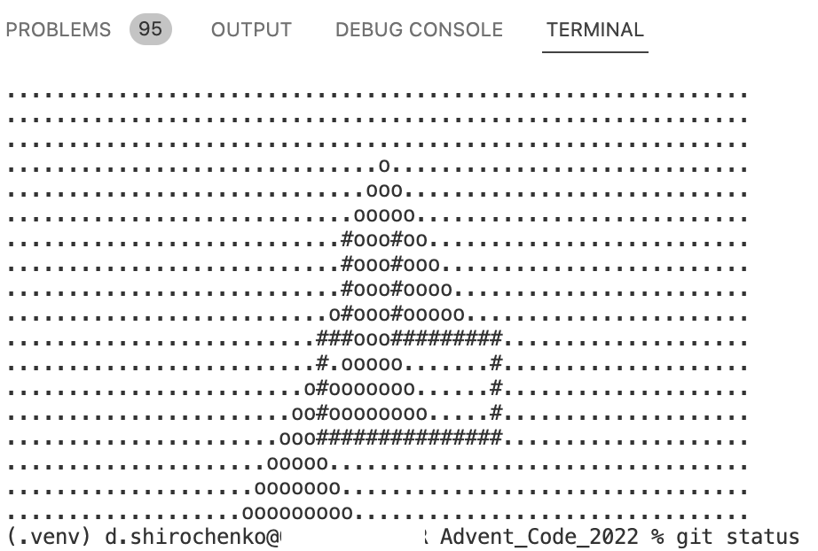

# My Advent of Code Solutions 🎄

 Here, you'll find my solutions to the [Advent of Code](https://adventofcode.com/) puzzles, where I battled against elves, snowmen, and CPU cycles to solve coding challenges faster than Santa's sleigh on Christmas Eve.

## Highlights 🌟

## Day 14: Regolith Reservoir 🏞️

The challenge? Simulate the falling sand and find out how many units of sand could come to rest without falling into the abyss below. 🎮 It's not just about calculating numbers; it's about painting a picture with code!

This delightful task made me feel like an explorer, a geologist, and an artist, all at once. 🎨 Care to venture into the cave with me? The code's right there, waiting for you.

[Check out the code for Day 14](./day_14_tasks.py)

## Running the Code 🏃

Want to join in on the festive fun? Follow these reindeer tracks:

1. Clone the repository: `git clone https://github.com/dmshirochenko/aoc_2022.git`
2. Navigate to the day you're interested in: `cd day-xx`
3. Run the solution with the magic word: `python solution.py`

## Happy Holidays! 🎉

Feel free to poke around, and may your holiday season be filled with joy, laughter, and zero code bugs!

---

_Special thanks to the elves at Advent of Code for making every December a coding adventure!_
